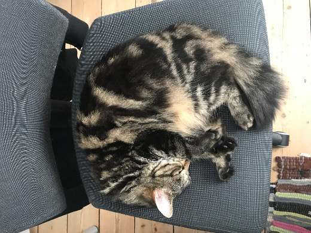
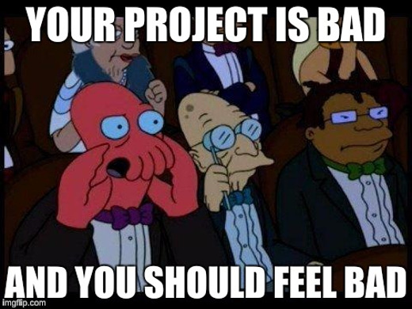
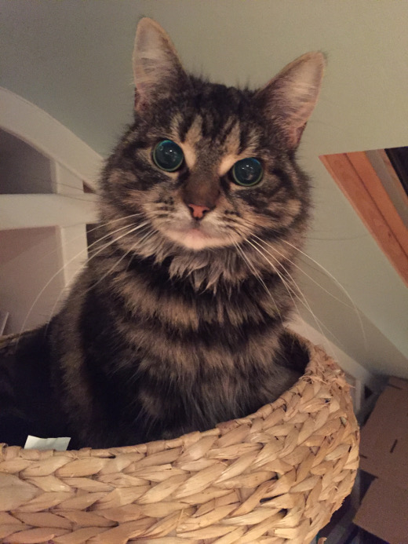

:title: Continuous: Past, present, future 
:css: 2017-guadec.css
:css-print: 2017-guadec-print.css
:data-transition-duration: 750
:data-x: r1600

----

:id: title-slide

Continuous: past, present, future
=================================

Building and testing GNOME, one commit at a time
------------------------------------------------

GUADEC 2017 | Manchester | Emmanuele Bassi <ebassi@gnome.org>
~~~~~~~~~~~~~~~~~~~~~~~~~~~~~~~~~~~~~~~~~~~~~~~~~~~~~~~~~~~~~

----

Welcome!
========

.. note::
   Hello, everyone, and welcome to GUADEC!
   
   If you are reading this, though, welcome to the notes to my GUADEC 2017
   talk.

----

.. note::
   Hi, my name is Emmanuele Bassi. You may remember me from such presentations
   as "All my Clutter state of the unions", or "An history of how GTK draws",
   or "The GTK scene graph that will be ready next year I promise".

----

What is "Continuous"?
---------------------

.. note::
   This time, though, I'm here to talk to you about building GNOME, and what
   is "Continuous".

----

:data-x: r0
:data-y: r1000

.. note::
   A bit of history.

   "Continuous" started as a spin off from the "GNOME OS" idea, as a way to
   generate an operating system image that the GNOME design team could
   download, install, and run in order to test changes that landed in Git.

   Before Continuous appeared, the design team had to deal with JHBuild,
   which was never really reliable for a day-to-day development of the whole
   of GNOME.

   Colin Walters created Continuous using OSTree in order to make it easy
   to upgrade an installed OS, and avoid downloading VM images from the
   GNOME infrastructure. It also allowed to go back and forth between
   different builds, at different points in time, thus making QA easier.

----

"GNOME Continuous" is a **continuous integration and delivery** platform that
builds a **well-defined set of components** that we call "GNOME" and **deploys**
the result into an OSTree repository

.. note::
   Let's start with a definition. We are going to go through each part of
   it, so that by the end we're going to understand what "Continuous" means
   and what it does for GNOME.

----

Wait, what is

**Continuous Integration**?

----

«In software engineering, continuous integration (CI) is the
practice of merging all developer working copies to a shared
mainline several times a day.» — `Wikipedia: Continuous integration
<https://en.wikipedia.org/wiki/Continuous_integration>`_

.. note::
   Thanks to Wikipedia, we have a somewhat shared definition of what "CI"
   means.
   
   You build everything against a known base, with known tools, and check
   that not only a commit, or a branch, or a tag go through the build step
   without issues, but also that the test suite works.

   You can run CI for each module inside a complex project, like GNOME,
   assuming you have a shared base environment you don't need to constantly
   build as a base. CI is what tells you that the commit you just pushed,
   or the branch you just merged, broke your own project.

----

Wait, what is

**Continuous Delivery**?

----

«Continuous delivery (CD) is a software engineering approach in
which teams produce software in short cycles, ensuring that the
software can be reliably released at any time.» — `Wikipedia:
Continuous delivery <https://en.wikipedia.org/wiki/Continuous_delivery>`_.

.. note::
   Again, thanks Wikipedia.

   In more prosaic terms, it's a way to take all the resources that
   make a project, deploy them at a "staging" location, and run the tests.
   If you manage to do this quickly enough, and under enouhg automation,
   then what you call "a release" is just the promotion of a build on a
   staging location to a production one.

   This has the additional benefit that it should remove the need for
   fixes done directly in production; just fix on the main line, drop into
   staging, run the tests, and promote to production.

   CD is what tells you that the commit some project pushed, or the branch
   some project merged, broke everything else.

----

Wait, what is a

**Continuous integration and delivery pipeline**?

.. note::
   Combining CI and CD into a single pipeline is what makes it possible to
   build and test complex projects, like GNOME.

   We cannot build each module in GNOME as a separate, independent entity;
   each module has dependencies that GNOME itself provides.

   We need CI to build every project inside GNOME.

   We need CD to ensure that all of GNOME gets built in a well-known
   sequence.

   Additionally, tests for each module should run inside a well defined
   environment, as they can interact and may require things like a session,
   or ancillary utilities. Your option is to create a mock environment
   separate for each one of them, and then hope the mock environment reacts
   as the real one; or to run all the tests in an environment close enough
   to the real one because it is the real one, even if it runs on a VM.

----

Who is CI/CD for?
-----------------

----

#. Maintainers / Contributors
#. Downstream packagers / OSVs
#. Application developers
#. QA

.. note::
   Maintainers use CI/CD to verify that their project builds in various
   configurations, and that any release or commit does not prevent the rest
   of the GNOME project from running.

   Contributors use CI/CD to verify that the changes they are creating
   do not break existing uses.

   Downstream packagers use CI/CD to have a known to be working baseline
   against which they can test their own patches and integration.

   OS vendors use CI/CD as the baseline for a minimum viable product
   based on GNOME.

   Application developers use CI/CD to have access to the platform API
   that GNOME provides, and eventually influence its direction.

   Quality Assurance use CI/CD to have access to the current build and
   verify the localisation, help, and behaviour are the expected ones.

----

:data-x: r1600
:data-y: r-8000

What does it all mean?

----

:data-y: r0

Continuous **builds** GNOME from source and **tests** it

.. note::
   In so far as saying that "GNOME" is a collection of projects, each made of
   code, documentation, data, and tests; and all projects interacts with each
   other in order to create an operating system as well as a desktop
   environment; and that the OS and desktop environment provide an agreed
   upon API for application developers to run their applications...

----

Continuous is GNOME
===================

.. note::
   Then Continuous **is** GNOME.

----

Hi, my name is Emmanuele and I'll be your build sheriff for today

----

`Build sheriff`_: an individual, or more commonly a group of individuals,
monitoring the state of the builder looking for broken builds and/or
tests

.. _Build sheriff:
   https://developer.mozilla.org/en-US/docs/Mozilla/Continuous_integration

.. note::
   Build sheriffs, pictured here in their natural habitat.

   A group of individuals (almost) constantly monitoring the continuous
   build pipeline, looking for broken builds and/or tests. These individuals
   are known as "build sheriffs". The sheriffs' role is to "keep the build
   green", or in other words, to keep the code in our respositories in a
   good state, to the extent that the state is reflected in the output shown
   on build.gnome.org.

----

:id: ogre

.. note::
   Many think that build sheriffs are ogres, waiting for a build to fail to
   chastise the poor committer who didn't have any idea that the commit they
   pushed to git.gnome.org could break the build for everybody else.

----

Sheriffs are your best friends

.. note::
   Of course we are not ogres. Checking that things build is what CI is for.

   When sheriffs see a build or test has been broken, they are empowered to
   take one of several actions, including pushing a fix; reverting the commit
   that caused the problem; or tagging a repository to a specific commit until
   the maintainer fixes the issue.

   A build sheriff is the person that will tell you that the latest commit
   in a dependency broke a module that depends on your project; or that a
   deprecation in a base dependency is now in effect, and that you should
   either disable deprecation errors, or fix your code; or that a new version
   of the compiler enabled a new warning, and thus your code is now failing
   to build.

   All of this happens on a neutral base, with complete logs and a known
   configuration, so you know where to look, how to reproduce, and possibly
   what to fix.

----

From great power comes

great responsibility

— `Ben Parker`_

.. _Ben Parker:
   https://en.wikipedia.org/wiki/Uncle_Ben

.. note::
   Build sheriffs have a very important role in any complex project. They
   do not act as gatekeepers, but they ought to be the ultimate arbiter of
   what stays into the code repository. What we do, as a free and open source
   software project, does not amount to dumping code that may or may not
   build in the lap of anybody with a network connection capable of
   cloning a series of repositories and downloading a bunch of tarballs.

   We provide people with a working set of interoperating components,
   and those components must **always** build, and at the very least
   result in something that can be run. Pushing randomly broken things to
   the master branch is not acceptable; that's what topic branches are
   for.

----

From no power comes

all the responsibility

— Emmanuele Bassi

.. note::
   I've been in the not really enviable position, for the past two years,
   of working as the unofficial build sheriff. All the responsibility, with
   none of the power.

----

What did I learn?
-----------------

.. note::
   Aside from badly quoting comic book characters, acting as a build sheriff
   was a way for me to learn about software development and engineering best
   practices; reliability; quality assurance; testing; integration and delivery.

   Of course, the real things I learned were slightly different.

----

:data-x: r0
:data-y: r1000

#. **Nobody** builds their code
#. Choice is **broken**
#. ``RESOLVED WORKSFORME``

.. note::
   But, it mostly taught me that nobody ever compiles their own code.
   
   Additionally, that every single maintainer who offers a build-time
   configuration choice does not test them after they get merged.
   
   Most definitely, that the common process to write free software
   amounts to: "Does it build on my laptop with a dirty build tree?
   If it does, then ship it".

----

The real treasure was

the hatred we found

along the way

.. note::
   As it turns out, I hate all software developers.

   I'm an equal opportunity hater.

----

.. image:: images/scum-and-villainy.jpg

«You will never find a more wretched hive of scum and villainy.
We must be cautious»

.. note::
   Mos Eisley, or: the stereotypical free and open source software project.

----

Hate, for lack of a better word, is good
----------------------------------------

.. note::
   This is the Gordon Gekko moment of the talk.

   I think that positive reinforcement is a great thing, and that we all
   strive to have something excellent and exciting for everyone else to
   see, use, and contribute towards.

   As a matter of fact, though, I find disappointment a powerful motivator
   to get stuff done, when it comes to fixing broken behaviour. I enjoy the
   moment when something goes from not working to working, and that includes
   every step of the way: from broken design, to broken architecture, to
   broken implementation, to broken testing, to broken integration.

   This motivation is part of why I contribute to GNOME; there are very, very
   few free and open source projects that actively encourage contributors to
   own up broken components, architectures, and design. Being a GNOME
   contributor means taking responsibility for something broken, fixing it
   at the best of your abilities, and then contribute it back to the larger
   community.

   It's the campsite rule — "leave the project in a better state than when
   you found it" — applied to free software.

----

.. note::
   Of course, your mileage may vary.

----

Lots of things to do
--------------------

.. note::
   Turns out that working in free software has left me with no shortage
   of broken things I can complain about on social media and on IRC, and
   possibly fix if I have push access to the Git repository.
   
   For any given day, in truth, there are more broken things than working
   ones.

   Free software is full of poorly thought through components that barely
   work in isolation, let alone together, and it's entirely up to us to
   see them all as a cohesive unit, and fix them.

----

:data-x: r1600
:data-y: r-6000

Let's talk about **building** GNOME

.. note::
   Building GNOME is not a trivial matter.

   GNOME requires a core set of functionality provided by the underlying
   kernel and basic user space in order to even build, let alone run.

   On top of that, GNOME is composed by many, many, **many** components,
   often interoperating through API; ABI; introspection ABI; and IPC ABI.

   In the past few months we had various cases where a CI/CD pipeline
   helped us track down changes all across the board, both originating
   from a module, and across various components.

----

:data-x: r0
:data-y: r-1000

Case study 1: **GLib tools**

.. note::
   GLib provides a few tools that deal with code generation for some of
   the boilerplate needed to write GObject. These tools are widely used
   in GNOME, and have existed since the early days of the platform, back
   when GLib was new and the world full of possibilities and wide-eyed
   idealists writing a desktop environment by first principles. This also
   means that a lot of the build infrastructure and code relying on them
   is old, and generally poorly understood. A constant of the software
   community is cargo culting our way out of a pickle, and before the
   advent of Stack Overflow, free software relied on simply having access
   to the code of various projects in order to not spend time understanding
   the tools at our disposal.

   Any change made to one of the tools provided by GLib has the potential
   for a knock-down effect on any project that directly, or indirectly,
   depends on them.

   Of course, we need to understand that none of the behaviours are actually
   specified, documented, or tested locally; so the only way to check
   whether a change has broken something is, quite literally, to rebuild
   the whole of GNOME and hunt down the breakage.

   This cannot be achieved on a GLib maintainer's laptop, for reasons
   of time, combinatorial explosion of dependencies, and complexity of
   the build matrix. This is where a service like a continuous
   integration pipeline is fundamental in order to have a good idea of
   whether a change can be done, or whether it should wait.

----

Case study 2: **Meson**

.. note::
   Meson is a new build system that is getting increasing adoption in
   the GNOME community, as a replacement for Autotools.

   Building applications with Meson is easy, and I thoroughly recommend
   switching to it.

   Libraries, though, have an API and an ABI, and projects that depend
   on them. Changing the build system in a platform library may end up
   breaking a direct dependency because of missing symbols, or a different
   soname than expected.

   Again, this is not something that can be directly caught with a test
   suite inside the project itself.

   Typically, this kind of breakage is caught by Linux distributions,
   but not every library ships to Linux platforms only; and the development
   cycle of Linux distributions is not generally synchronised with upstream
   development.

   We're also trying really hard to decouple GNOME from the underlying OS
   in order to let distributors and application developers not having to
   care about the environment outside of GNOME. This means taking up some
   of the responsibilities that have been, historically, the remit of
   packagers.

----

:data-x: r1600
:data-y: r2000

Decentralisation, composition, delegation
-----------------------------------------

.. note::
   As a community, we consciously end up splitting off components instead
   of centralising functionality; we prefer delegation and composition to
   piling API inside single points of failure.

   We like small components because we value the design philosophy that
   allows us to provide choice to our users, and the ability to compose
   an OS tailored to their needs, via loosely connected interfaces.

----

:data-x: r0
:data-y: r1000

.. note::
   This is, of course, a complete and utter fabrication.
   
   We like smaller components because it makes it easier for each maintainer
   to keep stuff in their head without going stark raving mad; or it makes it
   easier to insulate, or route around, maintainers with strong opinions with
   which we don't really agree; or to drop dependencies when they inevitably
   become unmaintained; or to avoid thinking about a specific niche job or
   area that we don't know very well.

   "Choice" is a side effect, mostly unintented and definitely not welcome,
   of this process.

----

Complexity **breaks** choice

.. note::
   No: Linux is not about choice.

   Every complex system that worked invariably evolved from a simple system
   that worked.

   A complex system designed from scratch never works and cannot be made to
   work.

   Additionally, the more complex you make a system, the more unlikely you
   can make it work in all its configurations. Only a small subset of
   interactions can be built, tested, and verified as working.
   
   If you're not testing a configuration, you must assume it's broken.

----

.. note::
   Shipping broken stuff is bad for users, because they will end up with a
   broken tool that does not help them achieve their goal, and if they can't
   do the things they set out doing, they will not use what we create.

   Shipping broken stuff is bad for maintainers, because people will file
   bugs, and maintainers get to fix them, and the time you spend tracking down
   and fixing bugs prevents you from writing features, which are cool and
   rewarding for the time you put into your project.

   Shipping broken stuff is bad for downstream packagers and OSVs, because
   they will be placed in the position of not being able to integrate the bad
   software you just released, and will file bugs — and while you can trick
   people with "it works for me" for a while, you can't do that forever.

----

A maintainer has a problem, and they think

*"I'll add some unit tests!"*

----

.. note::
   Unless you're working on a single project, with very few dependencies,
   and basically no users, unit testing won't solve anybody's issues.

   Integration testing is much more complicated, and it usually comes
   at a fairly high cost. You need to set up a way to build your
   project, and all its dependencies; then you need to set up an
   environment in which you can run your unit tests. Then you need to
   ensure that you build and run the tests every single time you, and
   possibly your direct dependencies, commit a change. This is usually
   slower than running `make check`, and if I learned anything in the
   past decade of free software contributions is that maintainers have
   issues doing that already.

   Integration testing is a spectrum, of course; if you build two
   libraries inside your project, you can check the integration of the
   two by simply writing a local unit test that exercises the combination
   of the API. If your project provides two separate services, you could
   write a unit that connects to both of them.

   We favour small, separate components; this means that there is
   spatial and temporal distance between them. Project A can change
   between commits of project B, and vice versa. This means you need
   something that checks both project A and B.

----

:data-x: r1600
:data-y: r0

----

:data-x: r0
:data-y: r1000

Stop shipping **broken** software

.. note::
   Summing up.

   If your project does not build unless it's your laptop…

   If your project does not build unless it's packaged for your
   Linux distribution…

   If you don't know if a change you committed will break
   something else outside your test suite…

   If you don't have a test suite running every time you
   commit something…

   Then you are shipping broken software.

   Stop doing that.

----

:data-x: r1600
:data-y: r0

**Continuous Integration/Delivery**

.. note::
   This is what Continuous Integration and Delivery is.

----

:data-x: r0
:data-y: r1000

Continuous Integration

\+

**GNOME**

.. note::
   Building GNOME is really building a lot of projects, in a well
   defined sequence, and making sure everything comes out all right
   at the othen end.

   Without automating this process, the continuous integration for
   the whole of the project would be a distributed mechanism also
   known as "humans over the Internet". We can, and we did, inflict
   this pain on our contributors, but I'd argue that unnecessary
   pain is not really fun, and, more importantly, it does not scale.

   Consider, if you will, how much better is the situation since
   we had Continuous, when running jhbuild. The amount of breakage
   went from a daily occurence to a random breakage introduced by
   system dependencies.

   These days we not only have Continuous running the full build;
   we also have Flathub running the GNOME SDK build, mostly from
   the same sources and using a fairly similar environment.

----

Continuous Integration

\+

GNOME

=

**♥**

.. note::
   This is what happens every day, seven days a week, 365 days a year.
   It's not always obvious, and you generally notice only if something
   breaks.

   You'll notice breakages because somebody will notify you on IRC, or
   file a bug, saying that your project fails to build on Continuous.

   You may notice it faster if you're on the #testable or #gnome-hackers
   IRC channels.

   We're still far away from something that is up to par, though.

----

:data-x: r1600
:data-y: r0

Travis_ / AppVeyor_ / GitLab_

.. _Travis:
   https://travis-ci.org

.. _AppVeyor:
   https://ci.appveyor.com

.. _GitLab:
   https://gitlab.com

.. note::
   The current state of the art for CI pipelines in the commercial
   and free software world are:

    - Travis, free for open source software, takes care of Linux
      and macOS (when it's not down)
    - AppVeyor, free for open source, takes care of Windows
    - GitLab, soon to the GNOME infrastructure nearest to you

   All three are generally based on a script that describes the
   build pipeline. All of them are good enough for building your
   app on a set of dependencies that are generally assumed not
   to change.

   As we've seen, this is really not the case when it comes to
   building and testing GNOME.

----

*Ad hoc* solutions

are *best* solutions

.. note::
   Continuous is, currently, a JS tool that consumes a JSON manifest that
   lists all the components it needs to build, in the order in which they
   must be built.

   The overall idea is similar to how flatpak-builder works: you build all
   the components into a reliable, separate sandbox, with the artifacts of
   the build accessible as the base system; no network connection; and no
   additional privileges. At the end, you get a file system image.

   In order to bootstrap this entire process, Continuous uses a Yocto base
   system, containing things like binutils, the compiler suite, and other
   components that are hard to build from source without a ton of patches.

   The Yocto base is there not just because of political concerns — we don't
   want to play favourites; but also because it's useful to have a neutral
   vendor as a target. It keeps us honest, and gives OS vendors a baseline
   to follow.

   After each build, Continuous takes the artefacts and pushes them into
   an OSTree repository. This de-duplicates the identical files, and allows
   us to have a full history of the build. The size of the OSTree repo for
   Continuous after 5 years of daily builds is ~570 GB.

   After each build, Continuous builds a VM image; boots it up; checks that
   we reach specific checkpoints in the boot process (smoketesting); and
   runs a series of tests (installed by each component) inside that VM. Then
   it spins down the VM, and puts it up for download if successful.

----

Where do we go from here?
-------------------------

.. note::
   Of course, this custom set up has a series of issues that have become more
   and more apparent over the years.

   The JS code base is not really what I'd call "easily accessible"; this is
   one of the reasons why it hasn't changed very much in the past 5 years.

   The JSON manifest is too easily broken, and at the same time not expressive
   enough. Ideally, the Flatpak builder manifest format would help us, but it
   would not be a 1:1 match with our requirements in any case.

   Additionally, it has integration issues with the underlying OS; for instance
   the VM image build has stopped working in March, after an upgrade that
   involved SELinux and FUSE. Debugging this has proven fairly hard, and not
   many people understand the intricacies of this whole system.

   The integration with Git is flimsy; the daemon gets often stuck, and it does
   not run on a commit hook to avoid DoS'ing the whole GNOME infrastructure.

   The build bot is heavily tied to the concept of a Build API (a subset of
   Autotools) which puts it at odds with the overall effort to move to Meson,
   unless we patch every single module not using Autotools.

----

:data-x: r0
:data-y: r1000

Work in **progress**

.. note::
   Still, there is an effort to make this whole thing work better.

   Switching away from an ad hoc JS script to a series of steps in a pipeline,
   using Buildbot as a base, like Flathub does, would increase the reliability
   of the process.

   Getting help from the libvirt and qemu developers to ensure that we can
   always build VMs for smoketesting and QA.

   Improving the notification system to tell maintainers when a build breaks;
   automate "fails to build" bugs; add tracking branches; add nightly builds
   for stable branches as well as continuous builds for master.

   Adding more people to the pool of build sheriffs, to increase coverage
   outside of the European timezones.

   Ensuring that applications are placed under Continuous Integration
   separately, using the GNOME SDK nightly builds as a base.

   Adding more tests for the system components, to track regressions.

----

Keep **building**

.. note::
   More importantly, though, we need every GNOME maintainer and contributor
   to follow the mindset that it's our responsibility to keep GNOME building
   and working, and that the world does not stop at our laptop; at our Git
   repo; at our project; or even at our distribution.

   Ensuring that GNOME, as a larger ecosystem, is seen as a reliable partner
   improves not just our standing in the free software world, but it makes
   our job easier.

   Continuous is not just a way to enforce good engineering practices; it is
   outreach.

----

Keep making GNOME **awesome**

.. note::
   In the end, we are all in this together, to create a strong and stable
   environment for our users.

   Our goal is not to build GNOME: it is to empower our users to achieve
   what they want to achieve, with as much support from their hardware
   platform as possible; with as much security and privacy we can offer;
   with as much flexibility we can reliably support.

----

:data-x: r1600
:data-y: r0

:id: endless-slide

.. image:: images/endless.png

.. note::
   I'd like to thank my employer, Endless, for letting me talk at GUADEC
   in front of all of you, wonderful people.

   If you're reading this notes, on the other hand, thanks for checking
   out my talk, and I'm sure you're wonderful as well.

----

Thank you!
==========

----

:id: colophon

 * License: CC by-sa 4.0
 * IRC: ``#testable`` on irc.gnome.org
 * Source: https://github.com/ebassi/2017-guadec
 * Slides: https://ebassi.github.io/2017-guadec
 * Blog: https://www.bassi.io
 * Job: https://endlessm.com

